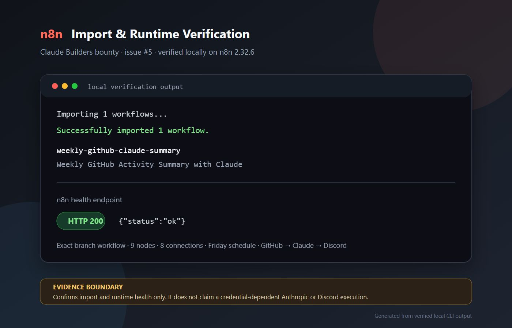

# Verification

This submission is designed to be importable into n8n and independently checkable without external credentials.

## Local validation

Run from the repository root:

```bash
python workflows/issue-5-weekly-dev-summary/validate_workflow.py
```

Expected output:

```text
workflow validation passed
nodes=9
connections=8
delivery=discord
model=claude-sonnet-4-20250514
```

The validator checks the exported workflow shape, Friday 5pm schedule, one-request-per-endpoint execution guards, quiet-week continuation, GitHub commits/issues/pulls fetches, Claude Messages API model, Discord webhook delivery, EN/FR language configuration, and five-step README constraint.

Run the deterministic transformation and delivery-boundary smoke test with:

```bash
python workflows/issue-5-weekly-dev-summary/smoke_greenfield.py
```

It verifies representative commit, issue, and merged-PR data; EN/FR configuration; prompt construction; one-request execution guards; quiet-week placeholder filtering; and the 1,900-character Discord delivery boundary without external credentials.

GitHub Actions runs both checks on every relevant push and pull request.

## Real n8n import verification

The exact workflow JSON from this branch was imported into a clean local n8n
`2.32.6` instance on Windows:

```text
Importing 1 workflows...
Successfully imported 1 workflow.
weekly-github-claude-summary|Weekly GitHub Activity Summary with Claude
```

After the import, the n8n instance started successfully and its health endpoint
returned:

```text
HTTP 200
{"status":"ok"}
```

This confirms that n8n accepts and persists the exported workflow. It does not
claim that the credential-dependent Anthropic and Discord requests completed.



The visual above is a presentation of the same verified local import and health
output. It is not a credential-dependent successful-execution screenshot.

## Live execution boundary

The workflow needs real `ANTHROPIC_API_KEY` and `WEEKLY_SUMMARY_DISCORD_WEBHOOK_URL` values to produce a live n8n execution screenshot. I did not fabricate that artifact from this environment.
