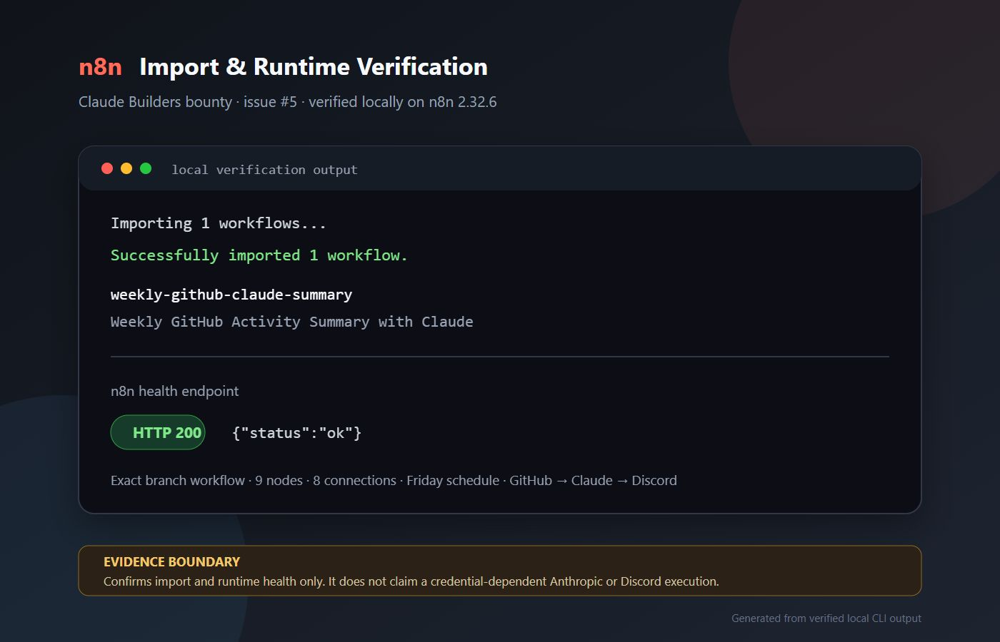

# Verification

This submission is designed to be importable into n8n and independently checkable without external credentials.

## Local validation

Run from the repository root:

```bash
python workflows/issue-5-weekly-dev-summary/validate_workflow.py
```

Expected output:

```text
workflow validation passed
nodes=9
connections=8
delivery=discord
model=claude-sonnet-4-6
github-fetch=paginated-fail-loud
```

The validator checks the exported workflow shape, Friday 5pm schedule, one-execution-per-endpoint guards, bounded GitHub pagination, fail-loud retry behavior, quiet-week continuation, GitHub commits/issues/pulls fetches, Claude Messages API model, Discord webhook delivery, EN/FR language configuration, and five-step README constraint.

Run the deterministic transformation and delivery-boundary smoke test with:

```bash
python workflows/issue-5-weekly-dev-summary/smoke_greenfield.py
```

It verifies representative commit, issue, and merged-PR data; EN/FR configuration; prompt construction; bounded paginated fetches; fail-loud retry guards; quiet-week placeholder filtering; and the 1,900-character Discord delivery boundary without external credentials.

GitHub Actions runs both checks on every relevant push and pull request.

## Actual n8n expression-resolver regression checks (offline)

The HTTP Request bodies use complete `={{ { ... } }}` expressions that return
objects. A leading `=` without expression delimiters leaves `$json.prompt` or
`$json.message` as literal text; the resulting body is not valid JSON. Both
original exported bodies reproduced that failure in n8n's real resolver.

Run the pinned resolver used by n8n `2.32.6` in an isolated runtime directory:

```bash
npm install --prefix /tmp/issue-5-n8n-expression-check --ignore-scripts --no-audit --no-fund --save-exact n8n-workflow@2.32.1
node workflows/issue-5-weekly-dev-summary/test_n8n_expressions.mjs /tmp/issue-5-n8n-expression-check
```

On Windows, pass a disposable absolute directory instead of `/tmp/...`. The
runtime is a test dependency, not part of the exported workflow. GitHub Actions
installs it outside the checkout under the runner's temporary directory.

Eight tests evaluate the exported bodies directly with
`Expression.resolveSimpleParameterValue`: ordinary data, quoted multiline
Unicode, expression-looking text, and backslash/control-character cases for
both Anthropic and Discord. They assert the exact object and its JSON wire
representation. The original export fails all eight; the corrected export
passes all eight. These tests exercise the real expression resolver, not a
mocked replacement, but do not run HTTP nodes, contact either service, or prove
end-to-end workflow success. The live execution evidence below remains pending.

## Prior real n8n import verification

The pre-expression-correction workflow JSON at commit
`b2f659a16beb2ada1ce39f3cf04bae5f2482ad9e` was imported into a clean local n8n
`2.32.6` instance on Windows:

```text
Importing 1 workflows...
Successfully imported 1 workflow.
weekly-github-claude-summary|Weekly GitHub Activity Summary with Claude
```

After the import, the n8n instance started successfully and its health endpoint
returned:

```text
HTTP 200
{"status":"ok"}
```

This confirms that n8n accepted and persisted that earlier export. It is
historical import evidence, not a fresh import of the expression-corrected
export, and does not claim that the credential-dependent Anthropic and Discord
requests completed.



The visual above is a presentation of the same verified local import and health
output. It is not a credential-dependent successful-execution screenshot.

## Live execution boundary

The workflow needs real `ANTHROPIC_API_KEY` and `WEEKLY_SUMMARY_DISCORD_WEBHOOK_URL` values to produce a live n8n execution screenshot. I did not fabricate that artifact from this environment.
